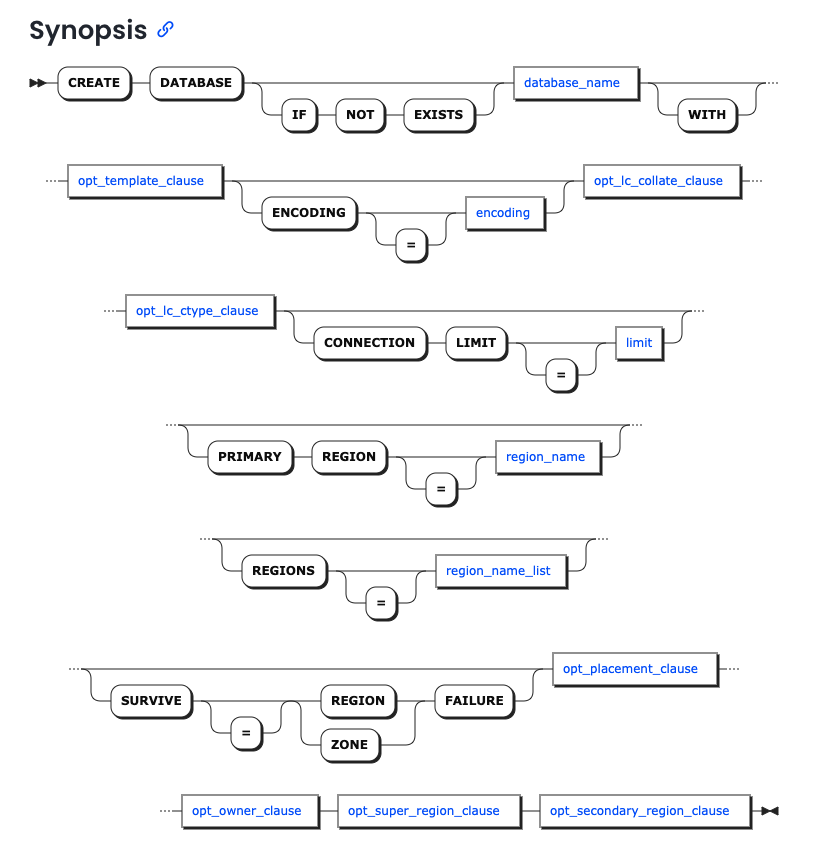

# cockroach-db-demo

`make` コマンドでシングルノードの CockroachDB のコンテナを立ち上げます。

```bash
make up        # CockroachDB 起動
make init      # （初回のみ）クラスタ初期化（必要な場合）
make sql       # SQLシェルに入る
make logs      # ログ確認
make down      # 停止・削除
make admin-ui  # 管理画面をブラウザで開く
```

---

## 基本的な SQL を実行

コンテナを立ち上げて、SQLシェルに入ります。

```bash
make up
make sql
```

### CLI クライアントの表示情報の意味

```txt
# Welcome to the CockroachDB SQL shell.
# All statements must be terminated by a semicolon.
# To exit, type: \q.
#
# Server version: CockroachDB CCL v24.1.0 (aarch64-unknown-linux-gnu, built 2024/05/15 21:28:33, go1.22.2 X:nocoverageredesign) (same version as client)
# Cluster ID: 24420497-0cd9-4404-8f7c-f842a3911743
#
# Enter \? for a brief introduction.
#
root@localhost:26257/defaultdb>                                                         
M-? toggle key help • C-d erase/stop • C-c clear/cancel • M-. hide/show prompt
```

```txt
# ようこそ CockroachDB の SQL シェルへ。
# すべてのステートメントはセミコロンで終了する必要があります。
# 終了するには、\q と入力してください。
#
# サーバーバージョン: CockroachDB CCL v24.1.0 (aarch64-unknown-linux-gnu, built 2024/05/15 21:28:33, go1.22.2 X:nocoverageredesign) (same version as client)
# クラスタ ID: 24420497-0cd9-4404-8f7c-f842a3911743
#
# # \? を入力すると簡単な紹介が表示されます。
#
root@localhost:26257/defaultdb>
M-? toggle key help • C-d erase/stop • C-c clear/cancel • M-. hide/show prompt
```

| 表示 |             日本語訳             |                   説明                   |
| ---- | -------------------------------- | ---------------------------------------- |
| M-?  | キーヘルプの表示・非表示切り替え | `Alt + ?` キーボードショートカットを表示 |
| C-d  | 終了または文字削除               | `Ctrl + d` 空の状態で押すとシェル終了    |
| C-c  | 入力キャンセルまたはクリア       | `Ctrl + c` 入力途中の文を取り消せる      |
| M-.  | プロンプトの表示切り替え         | `Alt + .` プロンプトを隠したりできる     |

※ M- は「Metaキー」（通常は Altキー）です。C- は「Controlキー（Ctrl）」です

## `demo` データベースの作成

```sql
CREATE DATABASE demo;
USE demo;
```

see. <https://www.cockroachlabs.com/docs/v25.1/create-database.html>



> [!NOTE]
>
> 構文定義が画像になっていてわかりやすい！😁

## テーブルの作成

```sql
CREATE TABLE users (
                       id UUID PRIMARY KEY DEFAULT gen_random_uuid(),
                       name STRING NOT NULL,
                       balance DECIMAL
);
```


